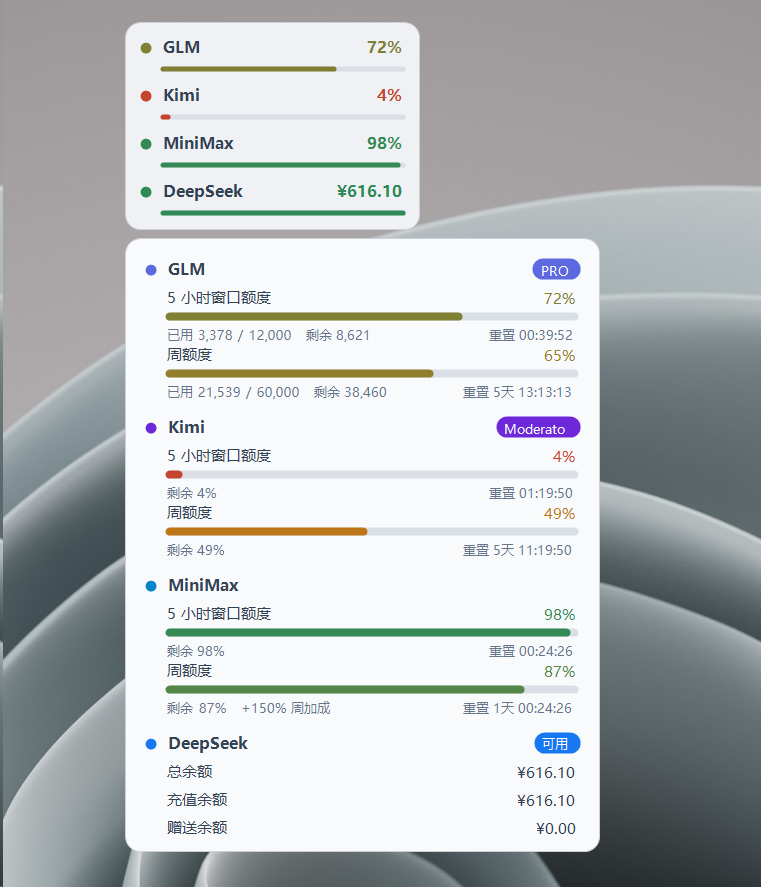
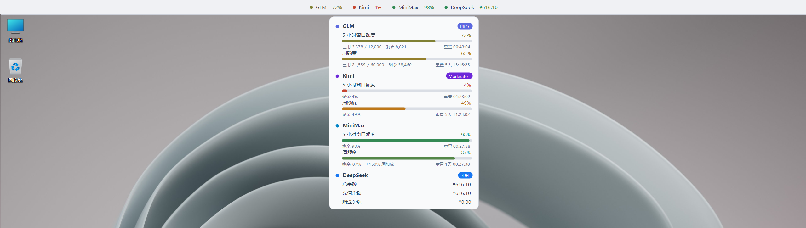

# QuotaWidget - AI 额度悬浮窗

一个轻量级的 Windows 桌面悬浮窗，实时监控多个 AI 服务商的额度使用情况。纯 C# WinForms 单文件实现，零依赖，双击即用。

另有置顶栏模式，贴屏幕顶边常驻显示：

鼠标悬停自动展开详情面板，显示各额度池（5 小时窗口 / 周额度 / 余额明细）及重置倒计时。

## 功能特性

- **多服务商监控**：GLM、MiniMax、Kimi Code Plan、DeepSeek
- **双显示模式**：桌面悬浮窗 / 置顶栏
- **实时刷新**：定时轮询（默认 60 秒），双击悬浮窗立即刷新
- **托盘图标**：悬停显示各服务商剩余额度摘要
- **连接测试**：设置页一键测试所有供应商的连接状态与额度明细
- **可定制**：浅色/深色主题、窗口透明度、位置记忆、开机自启

## 支持的服务商

| 服务商 | 区域 | 接口 | 展示内容 |
|--------|------|------|----------|
| GLM (智谱) | 国内 / 国际 | `open.bigmodel.cn` / `api.z.ai` | 5 小时窗口额度、周额度、会员等级 |
| MiniMax | 国内 / 国际 | `minimaxi.com` / `minimax.io` | 5 小时窗口额度、周额度、周加成 |
| Kimi (Code Plan) | - | `api.kimi.com` | 频率窗口额度、周额度、会员等级 |
| DeepSeek | - | `api.deepseek.com` | 账户余额（总/充值/赠送） |

## 快速开始

前提：Windows 自带 .NET Framework（无需安装 Visual Studio）。

1. 双击 `build.bat`，生成 `QuotaWidget.exe`
2. 运行 `QuotaWidget.exe`，首次启动在屏幕右上角显示悬浮窗
3. 右键悬浮窗或托盘图标 → **设置…** → **+ 添加**，选择服务商、填入 API Key
4. 鼠标悬停悬浮窗展开详情面板，双击立即刷新

> ⚠ API Key 明文存储在 exe 同目录的 `config.json`，请勿分享该文件。

## License

MIT
